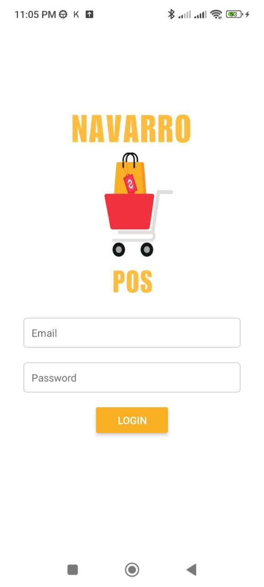

<h1>Punto de venta para tienda de abarrotes o similares</h1>

Este software de punto de venta ofrece una solución integral para la gestión de su negocio. Permite registrar ventas, aplicar descuentos y administrar departamentos. También facilita la creación, modificación y venta de productos, incluyendo la opción de venderlos en paquetes.

El sistema de inventario gestiona de forma precisa las entradas y salidas de productos, permitiendo además filtrar los registros por fechas y departamentos.

En el área de reportes, podrá consultar información detallada sobre ventas, ingresos, egresos y un informe completo del negocio.

El módulo de cajas permite registrar tanto ingresos como egresos, brindando un control eficiente de los movimientos financieros.

Además, el módulo de reparaciones le permite crear, listar y modificar órdenes de reparación, proporcionando un resumen claro de las ganancias con filtros por fechas para una mejor visualización de los resultados.

Este es la parte del front end, desarrollada con React Native 

La parte del backed esta desarrolla con nestJS utilizando postgresql como base de datos  

https://github.com/muqui/grosery-store-back-nest
<h3> Login</h3>

